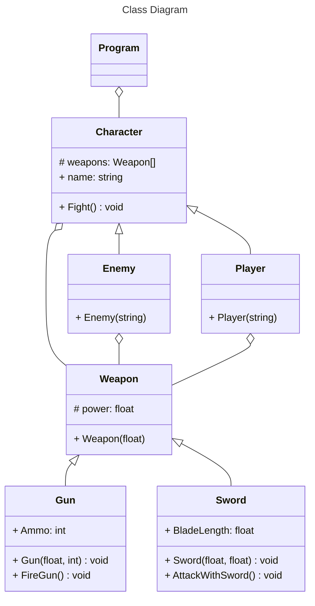

# MiniGame

```mermaid
---
title: Class Diagram
---
classDiagram
    Program o-- Character

    Character <|-- Enemy
    Character <|-- Player

    Weapon <|-- Gun
    Weapon <|-- Sword

    Character o-- Weapon
    Enemy o-- Weapon
    Player o-- Weapon

    class Character{
        # weapons: Weapon[]
        + name: string

        + Fight() void
    }

    class Enemy{
        + Enemy(string)
    }

    class Player{
        + Player(string)
    }

    class Weapon{
        # power: float

        + Weapon(float)
    }

    class Gun{
        + Ammo: int

        + Gun(float, int) void
        + FireGun() void
    }

    class Sword{
        + BladeLength: float

        + Sword(float, float) void
        + AttackWithSword() void
    }
```
